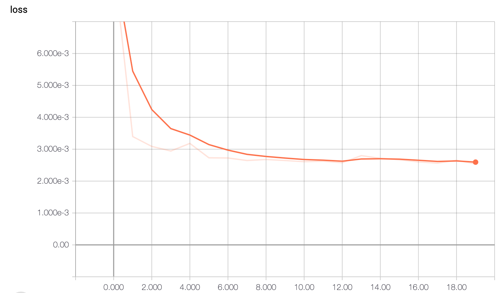
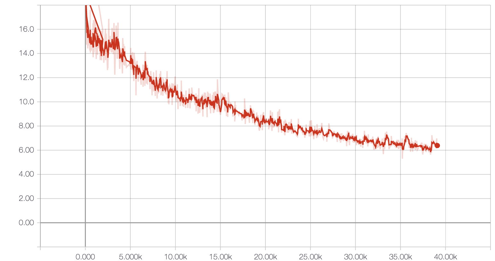
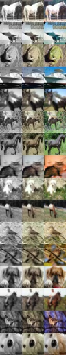
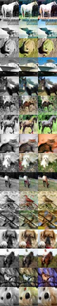

# dl-project-colorization
2019 deep learning final project

### 模型
models目录下提供了五种模型，分别是：auto-encoder模型，unet模型，fusion_with_resnet_classifier模型，fusion_with_label模型，和GAN模型。

auto-encoder模型采用简单的encoder-decoder结构，利用两层卷积和两层反卷积实现黑白图像到彩色的转换；

unet模型采用unet结构来实现转换过程；

fusion_with_resnet_classifier模型参考了2017年论文《Deep-Koalarization: Image Colorization using CNNs and Inception-ResNet-v2 》的思想，利用在ImageNet上预训练好的resnet分类器将灰度图片的分类作为先验知识输入卷积网络；

fusion_with_label模型则是直接将已经知道的cifar-10数据类别(共10类)作为先验知识输入网络；

GAN模型使用conditional GAN，conditional GAN的generator也使用了unet的结构，discriminator接受一个condition图像来判断生成图像是fake还是real，discriminatory是一个四层的卷积网络（without pooling），最后输出一个标量的validation值，表示生成图像fake/real的程度。

#### 训练

五种模型的训练均在train.py中，可以通过命令行输入['unet', 'autoencoder','fusion_label','fusion_resnet','gan']来区分训练的模型。例如输入python3 train.py -m unet即可利用unet模型进行训练。

use_logs参数用来控制tensorboard记录loss，除cgan外的所有模型模型均使用Keras的fit_generator接口，tensorboard每完成一个epoch通过callback记录一次；而cgan则是每个step通过tf.summary的接口手动写入；

项目为每个模型建立一个存放loss记录的文件夹，通过运行tensorboard --logdir='./logs/模型名称'可以查看不同模型的loss

 

 

##### fit_generator
Colorizer wrapper使用Keras提供的fit_generator可以很方便地在每个epoch中进行batch训练。

其中generator参数为生成batch-manner数据的迭代生成器，epochs参数为epoch的次数，steps_per_epoch是每个epoch会训练多少个batch，其值为int(np.ceil(train_generator.size / batch_size))，这里取ceil而不是floor可以让数据集大小不能恰好被batch_size整除的时候也可以返回迭代数据，此时最后一个batch的样本数量会小于batch_size.

##### cgan train_on_batch
conditional GAN中的images_A和images_B分别是原始彩色图和灰度图，其训练步骤如下：

1. 第一步通过generator.predict()生成fake的彩色图。
2. 以灰度图为conditional images，分别以原始彩色图和生成彩色图训练discriminator，

```
d_loss_real = colorizer.discriminator.train_on_batch([images_A, images_B], valid)
d_loss_fake = colorizer.discriminator.train_on_batch([fake_A, images_B], fake)

```

### 数据
使用Dataset.py中的CifarGenerator来迭代生成数据，初始化参数img_dir为训练/测试图片所在的目录路径；可以通过设置color_space参数决定使用LAB编码还是RGB编码；
对于每次迭代返回的X和Y，LAB编码会分别得到shape为(batch_size, 32, 32, 1), (batch_size, 32, 32, 2)的数据，x表示lightness通道，y表示剩下的两个通道；
而RGB得到的都是(batch_size, 32, 32, 3)的，但是y是灰度图，x是原始彩色图。

实际实验时，除cgan以外的模型使用的是LAB编码，而cgan则采用了RGB编码

对于fusion模型，CifarGenerator在用LAB编码产生训练数据的同时，还增加了先验知识的输入：其中Resnet模型利用了在ImageNet预训练的Inception-ResNet-v2模型，其对于每组图片输出图片的分类，是1000维的向量，将该向量和图片一起输入训练网络；Label模型将图片和其在cifar中的定义类别(10维向量)一同输入训练网络，其中类别通过每个图片的文件名获知。

#### 关于LAB编码
对图片进行编码不是用RGB color space而是用的LAB color space. LAB第一个通道其实就是灰度图，使用LAB通道进行网络训练时，输入的是lightness channel，即tensor shape为(batch_size, width, height, 1)；输出为剩下的两个channel，即tensor shape为(batch_size, width, height, 2)

The Lab color space describes mathematically all perceivable colors in the three dimensions L for lightness and a and b for the color components green–red and blue–yellow.

关于使用lab color space进行预处理的资料可以参考[about LAB color space 1](https://www.kaggle.com/preslavrachev/wip-photo-colorization-using-keras)中预处理的部分以及[about LAB color space 2](https://fairyonice.github.io/Color-space-defenitions-in-python-RGB-and-LAB.html)

#### 数据集
使用的是cifar数据，训练和测试的时候使用的数据都是彩色的而不是黑白数据!!

### Prediction
进行测试的脚本在两个jupyter noteboook中，以batch的方式进行测试，每个batch的结果存成一张图片，每行是一个sample的结果，以【灰度图，生成图，原始图】的方式写入。

下面给出的是第一个batch使用unet（左）和cgan（右）的结果

 
 